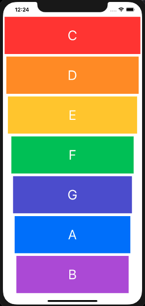

# Xylophone

This is a Xylophone app that was made with Swift using Xcode. Opacity of the buttons are also changed for 0.2 seconds too.  You can see it live here: https://www.youtube.com/watch?v=jXIb6DvtpdE&feature=youtu.be

